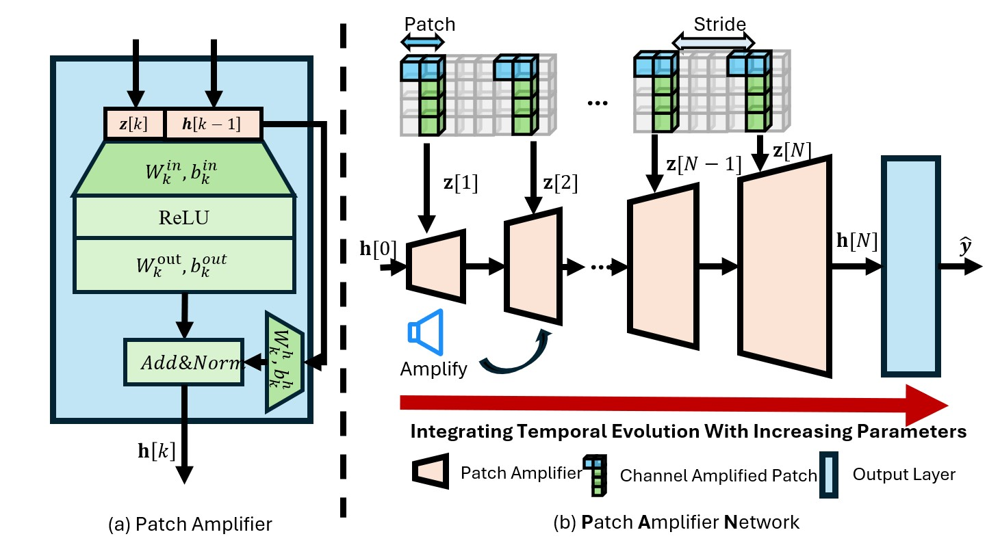

# 1 PAN: Evolving Channel-Amplified Patch For Multivariate Time Series Forecasting

This is the offcial repository of ICDE 2025 submission:  "PAN: Evolving Channel-Amplified Patch For
Multivariate Time Series Forecasting"




# 2 Prepare Datasets

ETTh1, ETTh2, ETTm1, ETTm2, Traffic, Exchange, Weather, Electricity will be downloaded automatically.

PEMS04, PEMS07, PEMS08 datasets are downloaded from [https://github.com/Davidham3/STSGCN](https://github.com/Davidham3/STSGCN), PEMS-BAY is downloaded from [https://github.com/liyaguang/DCRNN](https://github.com/liyaguang/DCRNN).

# 3 Preparation

## 3.1 install requirements

1. to run our code, **Please make sure your python version is >=3.8.**
2. install all the requirements, we assume that you have installed torch according to your environment
```
pip install -r ./requirements.txt
```


## 3.2 set up environment variable

Please first source this init.sh script:

```
source ./init.sh 
```

or manually add this directory to your PATHONPATH environment variable

```
export PYTHONPATH=./
```


# 4 run 

## 4.1 PAN

### long-term 
Please change the settings in the following for what you need.
```python
bash ./scripts/PAN/ETTm1.sh
```
### spatial-temporal 

```
bash ./scripts/PAN/PEMS04.sh
```

## 4.2 baselines
Change the model name in this script for different models.
```python
bash ./scripts/baselines/ETTh1.sh
```
### spatial-temporal 
Change the model name in this script for different models.
```
bash ./scripts/baselines/PEMS04.sh
```


